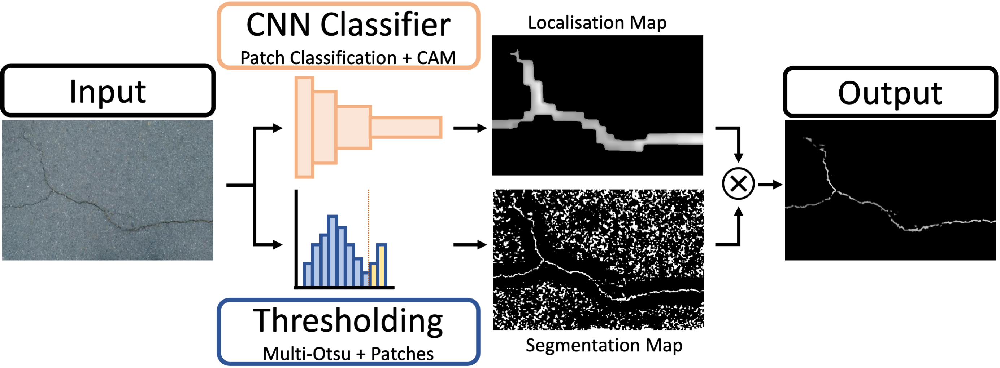

# Weakly-Supervised Surface Crack Segmentation by Generating Pseudo-Labels using Localization with a Classifier and Thresholding
This repository contains the code implementation of our weakly-supervised pseudo-labeling method from the paper: _Weakly-Supervised Surface Crack Segmentation by Generating Pseudo-Labels using Localization with a Classifier and Thresholding_.

König, J., Jenkins, M.D., Mannion, M., Barrie, P. and Morison, G., 2021. Weakly-Supervised Surface Crack Segmentation by Generating Pseudo-Labels using Localization with a Classifier and Thresholding. [[arXiv]](https://arxiv.org/abs/2109.00456)

#### Abstract
Surface cracks are a common sight on public infrastructure nowadays. Recent work has been addressing this problem by supporting structural maintenance measures using machine learning methods. Those methods are used to segment surface cracks from their background, making them easier to localize. However, a common issue is that to create a well-functioning algorithm, the training data needs to have detailed annotations of pixels that belong to cracks. Our work proposes a weakly supervised approach that leverages a CNN classifier in a novel way to create surface crack pseudo labels. First, we use the classifier to create a rough crack localization map by using its class activation maps and a patch based classification approach and fuse this with a thresholding based approach to segment the mostly darker crack pixels. The classifier assists in suppressing noise from the background regions, which commonly are incorrectly highlighted as cracks by standard thresholding methods. Then, the pseudo labels can be used in an end-to-end approach when training a standard CNN for surface crack segmentation. Our method is shown to yield sufficiently accurate pseudo labels. Those labels, incorporated into segmentation CNN training using multiple recent crack segmentation architectures, achieve comparable performance to fully supervised methods on four popular crack segmentation datasets.

# Overview



# This Repository
This repository contains code to run our proposed, weakly-supervised pseudo label creation method (`segmentation.py`)

**NOTE: Pretrained weights to run the pseudo-labeling procedure will be provided in due course**

### Requirements

The main requirements to run this project are shown in the `requirements.txt` which can be installed using PIP. We used Ubuntu 16.04, Python 3.8.11 and Cuda 10.1.


### Generating Pseudo Labels

To generate pseudo-labels using our weakly supervised method the `segmentation.py` file is used.

```
python segmentation.py --img_path=data/images_to_pseudo_label  --prediction_path=data/pseudo_labels --classifier_type=R50 --classifier_weight_path=weights_to_classifier.h5
```
The `classifier_type` can be set to R50, R101 or R152, however pretrained weights in the .h5 format are necessary (and need to be passed to the `classifier_weight_path` argument). `img_path` should contain the images to "pseudo label" and `prediction_path` is where the predictions will be stored.


# Reference

If you use our proposed model or code please cite our paper:

```
@article{konig2021aweakly,
  title={A Weakly-Supervised Surface Crack Segmentation Method using Localisation with a Classifier and Thresholding},
  author={K{\"o}nig, Jacob and Jenkins, Mark and Mannion, Mike and Barrie, Peter and Morison, Gordon},
  journal={arXiv preprint arXiv:2109.00456},
  year={2021}
}
```


# Acknowledgements:

This project uses code and data from the following:

- [DeepCrack Dataset](https://github.com/yhlleo/DeepCrack)
- [CrackForest Dataset](https://github.com/cuilimeng/CrackForest-dataset)
- [AigleRN + ESAR + LCMS Datasets](https://www.irit.fr/~Sylvie.Chambon/Crack_Detection_Database.html)
- [Retina U-Net](https://github.com/orobix/retina-unet)
