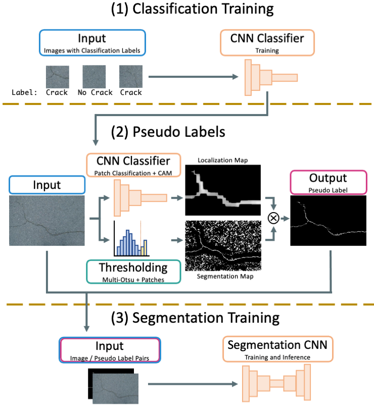

# A Weakly-Supervised Surface Crack Segmentation Method using Localisation with a Classifier and Thresholding

This repository contains the code implementation of our weakly-supervised crack segmentation method from the paper: _A Weakly-Supervised Surface Crack Segmentation Method using Localisation with a Classifier and Thresholding_.

König, J., Jenkins, M.D., Mannion, M., Barrie, P. and Morison, G., 2021. A Weakly-Supervised Surface Crack Segmentation Method using Localisation with a Classifier and Thresholding. [[arXiv (TBA)]]()

#### Abstract
Surface cracks are a common sight on public infrastructure nowadays. Recent work has been addressing this problem by supporting structural maintenance measures using machine learning methods that segment surface cracks from their background so that they are easy to localize. However, a common issue with those methods is that to create a well functioning algorithm, the training data needs to have detailed annotations of pixels that belong to cracks. Our work proposes a weakly supervised approach which leverages a CNN classifier to create surface crack segmentation maps. We use this classifier to create a rough crack localisation map by using its class activation maps and a patch based approach and fuse this with a thresholding based approach to segment the mostly darker crack pixels. The classifier assists in suppressing noise from the background regions, which commonly are incorrectly highlighted as cracks by standard thresholding methods. We focus on the ease of implementation of our method and it is shown to perform well on several surface crack datasets, segmenting cracks efficiently even though the only data that was used for training were simple classification labels. 

# Overview



# This Repository
This repository contains code to run our proposed, weakly-supervised crack segmentation method. It contains files that:

- Download, prepare and augment the Crackforest ([CFD](https://github.com/cuilimeng/CrackForest-dataset)), AigleRN+ESAR+LCMS ([AEL](https://www.irit.fr/~Sylvie.Chambon/Crack_Detection_Database.html)) and DeepCrack ([DCD](https://github.com/yhlleo/DeepCrack)) datasets (`data/get_data.py`, `data/patches.py`)
- Train a classifier (`classifier.py`)
- Run our proposed segmentation method  (`segmentation.py`)
- Evaluate segmentation results  (`evaluate.py`)
- Pretrained ResNet50 classifier weights on CFD, AEL and DCD  (`weights/`)

### Requirements

The main requirements to run this project are shown in the `requirements.txt` which can be installed using PIP. We used Ubuntu 16.04, Python 3.8.11 and Cuda 10.1.


# Usage

A quick demonstration of our method can wbe found in the Notebook `demo.ipynb`.

To run this project you first need to clone this repository:

```
git clone https://github.com/jacobkoenig/WeaklySupervisedCrackSeg
```

## Quick Start

The notebook in `demo.ipynb` shows a quick-start demo on how to get started with the pretrained-weights already supplied and some sample images
Otherwise, use the detailed instructions below to download, train and infer on the three datasets.

## Detailed Instructions

### Data Preparation

To move to the data directory and download the datasets run the following:

```
 cd data
 python get_data.py
```

From within the data directory this command augments the data (rotating 0+90 degree and then flip, horizontall, vertically, and horizontal+vertical)
Then it creates patches and moves them into crack / no\_crack directories, depending on wether a crack is present.

**NOTE:** Running this script will amount in about ~172,000 files in the data dir and grow this directory to about ~5.2GB.

```
 python patches.py
```

Then move back to the main directory

```
 cd ..
```

### Classifier Training

The classifier can then be trained and evaluated on each dataset:

For training a ResNet50 classifier on _CFD_ using `GPU:0` use the following:

```
python classifier.py --train_data=data/CFD/img_aug_patches/train --val_data=data/CFD/img_aug_patches/val --test_data=data/CFD/img_test_patches --classifier_type=R50 --classifier_weight_path=weights/custom_CFD_R50.h5 --device=gpu:0
```

For training a ResNet50 classifier on _AEL_ using `GPU:0` use the following:

```
python classifier.py --train_data=data/AEL/img_aug_patches/train --val_data=data/AEL/img_aug_patches/val --test_data=data/AEL/img_test_patches --classifier_type=R50 --classifier_weight_path=weights/custom_AEL_R50.h5 --device=gpu:0
```

For training a ResNet50 classifier on _DCD_ using `GPU:0` use the following:

```
python classifier.py --train_data=data/DCD/img_aug_patches/train --val_data=data/DCD/img_aug_patches/val --test_data=data/DCD/img_test_patches --classifier_type=R50 --classifier_weight_path=weights/custom_DCD_R50.h5 --device=gpu:0
```

This script also supports custom options:
The classifier.py file has several command line args. Specify the `--classifier_type={..}` to be either `R50`, `R101` or `R152` for ResNet 50, ResNet101 or ResNet152 respectively.
When no GPU is available, it is possible to train using the CPU _(not recommended as it will take a long time)_ by setting `--classifier_type={..}` to be `CPU:0` or in case of multi-gpu setups select another GPU such as `GPU:3`.
If `--val_data={..}` is not specified, the classifier will train for the number of epochs and save the last weights. If `--test_data={..}` is not specified, the classifier will simply not perform evaluation (and it will still be usable in later steps). If any of `--train_data={..}`, `--val_data={..}` or `--test_data={..}` is set, it requires to link to a directory containing two sub-dirs (class1 and class2), in this case `crack` and `no_crack`.

### Generating Predictions

To generate predictions using our weakly supervised method the `segmentation.py` file is used.
Predictions for CFD and using the previously trained ResNet50 classifier can be generated in the `predictions/CFD` directory as follows:

```
python segmentation.py --img_path=data/CFD/img_test_patches --img_path=data/CFD/img/test  --prediction_path=predictions/CFD --classifier_type=R50 --classifier_weight_path=weights/custom_CFD_R50.h5
```

For AEL the command would look like the following:

```
python segmentation.py --img_path=data/AEL/img_test_patches --img_path=data/AEL/img/test  --prediction_path=predictions/AEL --classifier_type=R50 --classifier_weight_path=weights/custom_AEL_R50.h5
```

and for DCD:

```
python segmentation.py --img_path=data/DCD/img_test_patches --img_path=data/DCD/img/test  --prediction_path=predictions/DCD --classifier_type=R50 --classifier_weight_path=weights/custom_DCD_R50.h5
```

It is also possible to change some hyperparameters of this segmentation method using the `--patch_size={..}`, `--stride_classifier={..}`, `--stride_thresholding={..}` arguments to change the patch size used for classification/localisation/thresholding, the stride that is used during the classification/localisation process and the stride which is used for thresholding. You can also select what device to run the segmentation on with the `--device ={..}` argument similar to running `classifier.py`.

### Evaluation

The macro F1 score of our method can then be calculated and shown based on the predictions and ground truths by using the `evaluate.py` script. Using the command line arguments prediction_path `--prediction_path={..}` and `--gt_path={..}` will run this script and print the macro F1 score. For all three datasets the commands are the following:

```
python evaluate.py  --prediction_path=predictions/CFD  --gt_path=data/CFD/gt/test
python evaluate.py  --prediction_path=predictions/AEL  --gt_path=data/AEL/gt/test
python evaluate.py  --prediction_path=predictions/DCD  --gt_path=data/DCD/gt/test
```

# Pretrained Models

The model weights of the ResNet50 classifier that have been trained by our approach can be obtained from:

- CrackForest (CFD): `weights/classifier_R50_CFD.h5`
- DCD: `weights/classifier_R50_DCD.h5`
- AEL: `weights/classifier_R50_AEL.h5`

The `demo.ipynb` shows an example on how they can be used to create predictions without needing to train and prepare the classifier and the data first.

The segmentation performance of the pretrained models and our method using the Macro F1 score is shown below:

| F1  | CFD  | DCD  | AEL |
|---|---|---|---|
| ResNet50 Classifier:  | 62.73%  | 78.16%  | 45.04%  |
**NOTE**: These results here are slightly better from the ones in the paper as this only shows a single run, whereas in the paper they are *averaged over multiple runs*.


# Using a Custom Dataset

When following the steps on how to run our method one can also use a custom dataset. For classifier training, it needs to be ensured that the data paths for the `classifier.py` script each contain two sub-directories with patches in a `crack` and `no_crack` directory. It is also possible to customise the hyperparameters such as learning rate, epochs etc. in this script or even add a classifier that is not one of the options supported.
To create the weakly supervised segmentation, the `segmentation.py` script should be run with the data path arguments pointing to the custom inference dataset. It may be worth, depending on the dataset, to also modify patch sizes and strides.
For debugging purposes one may also want to observe the interim outputs of our method. For this, the `demo.ipynb` shows an example.

# Reference

If you usesour proposed model or code please cite our paper:

**TBA**

# Results
Sample results or our *weakly supervised* method using ResNet50 classifier in comparison with a *fully supervised U-Net* and the ground truth (GT):


# Acknowledgements:

This project uses code and data from the following:

- [DeepCrack Dataset](https://github.com/yhlleo/DeepCrack)
- [CrackForest Dataset](https://github.com/cuilimeng/CrackForest-dataset)
- [AigleRN + ESAR + LCMS Datasets](https://www.irit.fr/~Sylvie.Chambon/Crack_Detection_Database.html)
- [Retina U-Net](https://github.com/orobix/retina-unet)
